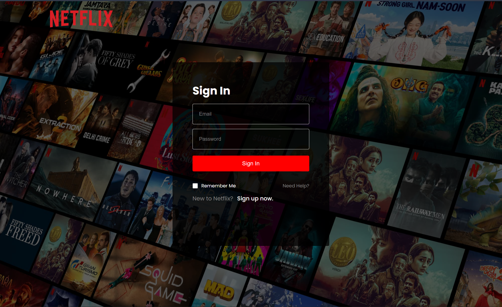

# Netflixx Clonee

A responsive semi-functional Netflix clone built using React.js, styled-components, and Firebase for backend services. This project replicates some of the core functionalities of Netflix, providing users with an intuitive and immersive streaming experience.

Check out the project hosted on Vercel @ https://netflixx-clonee-three.vercel.app/
---

## 🚀 Features

* **Responsive Design**: Optimized for both desktop and mobile devices.
* **User Authentication**: Secure sign-in and registration using Firebase Authentication.
* **Video Playback**: Stream trailers and video content directly within the app.
* **Firebase Integration**: Backend services powered by Firebase for real-time data handling.

---

## 🛠️ Tech Stack

* **Frontend**: React.js, styled-components, React Router
* **Backend**: Firebase Authentication, Firebase Firestore
* **APIs**: The Movie Database (TMDb) API for movie data
* **Deployment**: Vercel or Netlify

---

## 📸 Screenshots


*Login page.*


*Home Page showcasing featured content.*

---

## ⚙️ Installation

### Prerequisites

* Node.js (v14 or higher)
* npm or yarn
* Firebase project setup

### Steps

1. **Clone the Repository**:

   ```bash
   git clone https://github.com/Adnan-Akil/Netflixx-Clonee.git
   cd Netflixx-Clonee
   ```

2. **Install Dependencies**:

   ```bash
   npm install
   ```

3. **Set Up Firebase**:

   * Create a Firebase project at [Firebase Console](https://console.firebase.google.com/).
   * Enable Firebase Authentication and Firestore.
   * Add your Firebase configuration to the project.

4. **Run the Application**:

   ```bash
   npm start
   ```

   The app will run on [http://localhost:3000](http://localhost:3000).

---

## 🔧 Configuration

Ensure to replace the Firebase configuration in the `firebase.js` file with your own Firebase project credentials.

---
